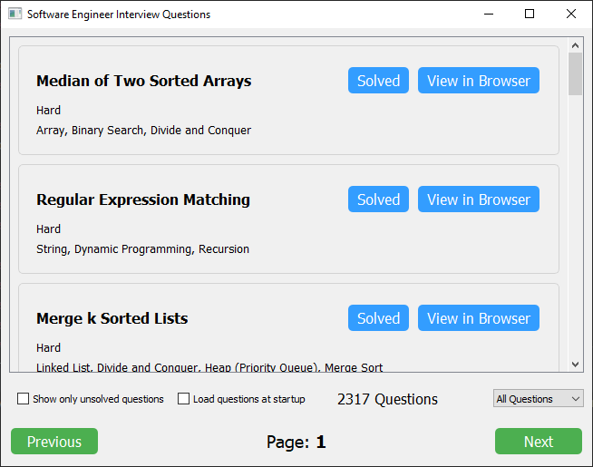

# Software Engineer Interview Questions - PyQt Application

This PyQt application helps users to practice and track their progress on software engineering interview questions. It fetches questions, displays them in an organized manner, and allows users to mark questions as solved, view them in the browser, and filter them based on difficulty and solved status.

## Features

- Fetch and display interview questions.
- Mark questions as solved/unsolved.
- View questions in the browser directly from the app.
- Filter questions by difficulty and solved status.
- Load questions at startup setting.

## Installation

1. Clone the repository:
```bash
git clone https://github.com/assaf-malki/software-engineer-interview-questions.git
```
2. Navigate to the project directory:
```bash
cd software-engineer-interview-questions
```
3. Install the required dependencies (make sure you have Python and pip installed):
```bash
pip install -r requirements.txt
```

## Usage

Run the application with Python:

```bash
python main.py
```

## Screenshots



## How to Contribute

1. Fork the repository.
2. Create a new branch (`git checkout -b feature-branch`).
3. Make your changes.
4. Commit your changes (`git commit -am 'Add some feature'`).
5. Push to the branch (`git push origin feature-branch`).
6. Create a new Pull Request.
